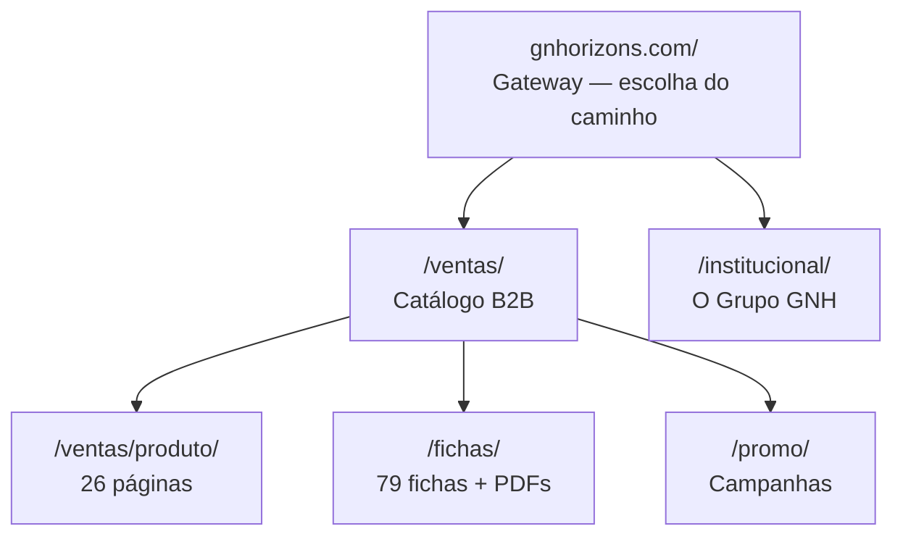

# GNH — Sitio Web

> [!info] O que é isto
> Documentação completa do site **gnhorizons.com** — arquitetura, infraestrutura, deploy,
> catálogo, analytics, SEO e decisões. Este nota é o mapa; cada tema tem sua própria nota.

**Site no ar:** https://gnhorizons.com
**Repositório:** `leonardojacquier/KKNUTHS` · branch `claude/professional-website-design-qqgnfg`
**Idioma do site:** espanhol (base) · institucional também em pt / en / zh

---

## Mapa da documentação

| Nota | Do que trata |
|---|---|
| [[01 - Arquitetura do site]] | Como o site é construído: as três frentes, o build, os módulos |
| [[02 - Infraestrutura e DNS]] | VPS, Caddy, Cloudflare, e-mails, certificados |
| [[03 - Deploy]] | Como o código vai pro ar (automático a cada 2 min) e como conferir |
| [[04 - Catalogo e fichas tecnicas]] | Produtos, tabelas de specs, geradores de ficha, PDFs |
| [[05 - Analytics e rastreamento]] | Supabase, eventos, resumo no Telegram, filtro anti-bot |
| [[06 - SEO e GEO]] | Sitemap, dados estruturados, llms.txt, o que falta indexar |
| [[07 - Promocoes e campanhas]] | Landing de promoção, links UTM, preview nas redes |
| [[08 - Marca e conteudo]] | Posicionamento, paleta, tipografia, regras de linguagem |
| [[09 - Operacao diaria]] | Receitas do dia a dia: publicar, adicionar produto, trocar promoção |
| [[10 - Pendencias e roadmap]] | O que falta, em ordem de impacto |
| [[11 - Decisoes]] | Decisões tomadas e o porquê — para não revisitar |
| [[12 - Glossario]] | Termos que aparecem na documentação |
| [[13 - Plano - Painel e Central de Campanhas]] | Plano do painel de indicadores e da central de artes *(aguardando aprovação)* |
| [[14 - Acessibilidade e H1]] | O H1 que o JS apagava, alvos de toque e `alt` nas imagens |

---

## Estado atual (29/07/2026)

| Indicador | Valor |
|---|---|
| URLs no sitemap | **109** |
| Páginas de produto | 26 |
| Fichas técnicas (HTML + PDF) | 79 + 79 |
| Produtos no catálogo de busca | 40 |
| Pessoas reais (últimos 10 dias) | ~88 |
| Cliques de WhatsApp | 7 |
| Leads de formulário | 0 |

> [!warning] O gargalo de hoje
> O site **ainda não está no Google Search Console**. Sem isso, as 109 URLs não são
> indexadas ativamente e todo o trabalho de SEO fica represado. Ver [[10 - Pendencias e roadmap]].

---

## As três frentes do site

---

## Contatos oficiais

- **WhatsApp geral GNH:** +595 995 360060
- **Ventas:** comercial@gnhorizons.com
- **Nuevos negocios:** nuevosnegocios@gnhorizons.com
- **Kasteller:** +595 985 869 600
- **Intonaco:** +595 993 366 650 · comercial@intonaco.com.py
- **Endereço:** Av. República del Perú km 7, Ciudad del Este · Acceso Sur, Ñemby, Paraguay
