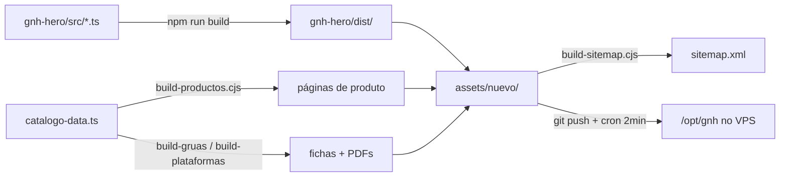

# Arquitetura do site

[[00 - Indice|← Índice]]

## A ideia central

O site tem **três frentes independentes** que compartilham marca e contatos, mas não
compartilham layout. Isso foi uma decisão consciente — ver [[11 - Decisoes]].

| Rota | O que é | Como é gerada |
|---|---|---|
| `/` | Gateway — a pessoa escolhe Ventas ou Institucional | Vite (SPA leve) |
| `/ventas/` | Catálogo B2B com busca, filtros e cotação por WhatsApp | Vite + `catalogo-data.ts` |
| `/institucional/` | O Grupo GNH, fortalezas, negócios, contato (4 idiomas) | `build-institucional.cjs` |
| `/ventas/<produto>/` | 26 páginas estáticas de produto (SEO) | `build-productos.cjs` |
| `/fichas/<slug>.html` | 79 fichas técnicas + PDF | 3 geradores (ver [[04 - Catalogo e fichas tecnicas]]) |
| `/promo/<campanha>/` | Landings de campanha | HTML escrito à mão |

## Onde mora cada coisa

```
KKNUTHS/
├── gnh-hero/                 ← projeto Vite (a FONTE do site)
│   ├── src/                  ← módulos TypeScript
│   │   ├── gateway.ts        ← página de entrada
│   │   ├── ventas.ts         ← catálogo, busca, promoções, formulário
│   │   ├── catalogo-data.ts  ← FONTE ÚNICA dos produtos e specs
│   │   ├── aditivos-data.ts  ← catálogo químico (gerado)
│   │   ├── track.ts          ← rastreamento (ver [[05 - Analytics e rastreamento]])
│   │   ├── hero.ts / portal.ts / curtain.ts / sections.ts / footer.ts
│   ├── public/               ← estáticos que entram no build (img, fichas, pdf)
│   └── tools/                ← geradores (Node/Python)
├── assets/nuevo/             ← A RAIZ PUBLICADA do site (é o que o Caddy serve)
├── deploy/                   ← Supabase SQL, Telegram, Umami, Caddy
├── src/                      ← ⚠️ OUTRO projeto: a calculadora TitanCalc (React)
└── *.sh                      ← scripts de deploy
```

> [!danger] Duas coisas diferentes no mesmo repositório
> `src/` é a **calculadora de pavimento TitanCalc**, não tem relação com o site GNH.
> O site vive em `gnh-hero/` (fonte) e `assets/nuevo/` (publicado). Não misturar.

## O fluxo do build



**Regra de ouro:** `assets/nuevo/` é o que vai pro ar. O build do Vite gera só uma
parte (gateway + ventas + bundles); as páginas de produto, fichas e promoções são
geradas ou escritas à parte e **convivem** na mesma pasta. Por isso o deploy copia
seletivamente — nunca `rm -rf assets/nuevo` sem regenerar tudo.

## Fonte única de verdade: `catalogo-data.ts`

Este arquivo é o coração do catálogo. Dele saem:

- os **cards** do catálogo em `/ventas/`
- as **páginas estáticas** de produto (`build-productos.cjs`)
- as **tabelas de specs** dentro das páginas
- os **dados estruturados** (JSON-LD) para o Google
- o **índice de busca** do site

Cada produto tem `name`, `brand`, `img`, `note` e `tags` (os termos que a busca aceita).
As specs ficam num mapa separado: `h` com os cabeçalhos e `r` com a lista de linhas.

> [!tip] A coluna "Ficha"
> Quando um produto tem fichas técnicas, a última coluna da tabela traz
> `<a href="/fichas/slug.html">Ver ficha</a>`. O gerador reconhece esse padrão e
> não escapa o HTML — é a única exceção, tudo o mais é escapado.

## Progressive enhancement

O site funciona em três camadas, e cada uma degrada sem quebrar:

1. **HTML puro** — todas as páginas de produto e fichas são legíveis sem JavaScript
2. **Vanilla JS** — IntersectionObserver para revelar seções, parallax com rAF
3. **GSAP / Lenis** (CDN) — quando carregam, assumem o controle e desligam a camada 2

`prefers-reduced-motion` desliga tudo. Se a CDN cair, o site continua funcionando.

## Peso das páginas

As páginas de produto pesam **7–11 KB**. Para comparação, a concorrente
(lumelogistica.com.py, feita em Wix) gasta ~237 KB por página. Isso é vantagem real
em SEO e em conexão móvel ruim.

---

**Ver também:** [[03 - Deploy]] · [[04 - Catalogo e fichas tecnicas]] · [[02 - Infraestrutura e DNS]]
