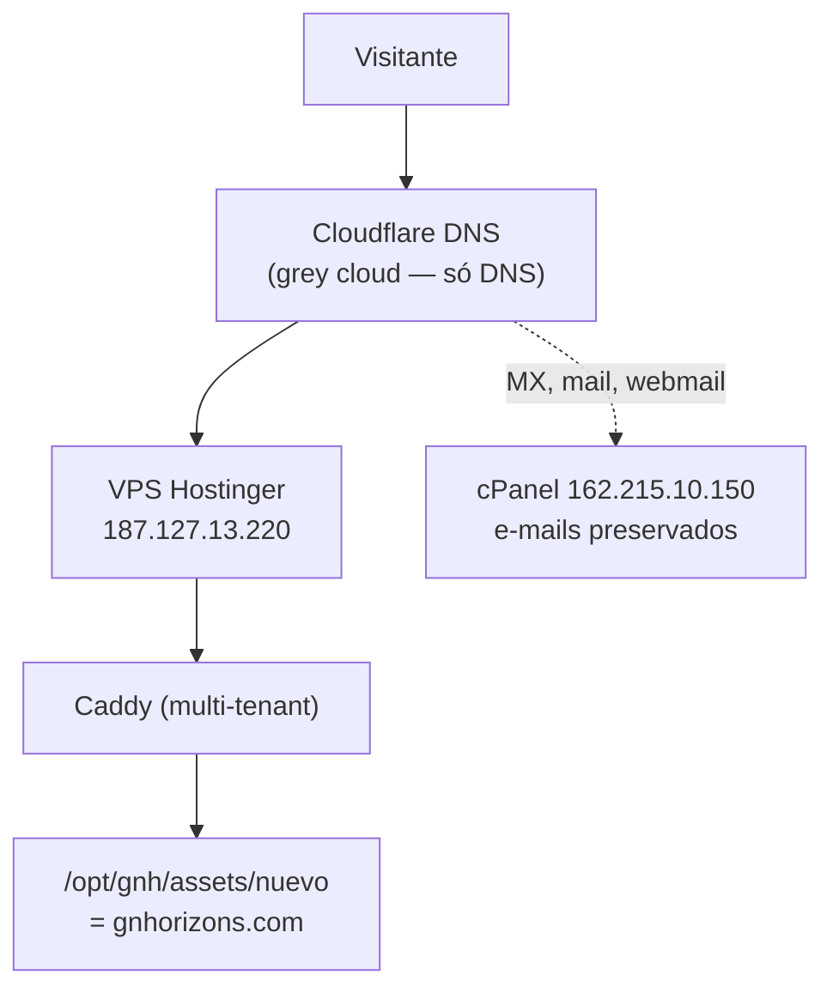

# Infraestrutura e DNS

[[00 - Indice|← Índice]]

## Visão geral



## O servidor

| Item | Valor |
|---|---|
| Host | `root@srv1555380.hstgr.cloud` (Hostinger) |
| IP | 187.127.13.220 |
| Servidor web | Caddy, **compartilhado com outros domínios** |
| Raiz do site | `/opt/gnh/assets/nuevo` |
| Repositório no VPS | `/root/KKNUTHS` |
| Certificado | Let's Encrypt (automático pelo Caddy) |

> [!danger] Caddy é compartilhado — cuidado máximo
> O Caddyfile serve **vários domínios** de projetos diferentes. Um reload com erro
> derruba todos.
> **Sempre:** `caddy validate --config /etc/caddy/Caddyfile` **antes** de
> `systemctl reload caddy`.
>
> **Incidente conhecido:** o autodeploy do poker-bot já sobrescreveu o Caddyfile
> uma vez. Se o site cair sem motivo, verifique se o bloco `gnhorizons.com` ainda existe.

## O bloco do Caddy

Guardado em `deploy/caddy-gnhorizons.txt`. O essencial:

```caddy
gnhorizons.com, www.gnhorizons.com {
	import gnh_security
	root * /opt/gnh
	encode gzip

	# vídeos e logos vivem fora de nuevo/
	handle /assets/video/* { root * /opt/gnh; file_server }
	handle /assets/img/*   { root * /opt/gnh; file_server }

	# HTML sempre fresco; estáticos com cache
	@html path / /index.html */ *.html
	header @html Cache-Control "no-cache"

	file_server
}
```

> [!danger] O root do gnhorizons.com é `/opt/gnh` — nunca `/opt/gnh/assets/nuevo`
> O **gnhorizons.com é o site oficial da empresa**; o `gnh.vortex369.com.br`
> existe **só como preview** para o dono ver antes de publicar. Os dois servem a
> mesma pasta `/opt/gnh`, que é o que os scripts de deploy montam: o conteúdo de
> `assets/nuevo/` vai para a raiz (preservando as URLs indexadas) e o
> `gnh-redesign.html` é copiado por último para `index.html`, virando a home.
>
> Entre jul e ago/2026 o bloco esteve apontado para `/opt/gnh/assets/nuevo`. Com
> esse root o redesign em `/opt/gnh/index.html` **nunca era servido** — a home do
> domínio oficial caía no site antigo — e as fotos das plataformas quebravam,
> porque `assets/nuevo/img/...` do redesign viraria
> `/opt/gnh/assets/nuevo/assets/nuevo/img/...`, que não existe. O erro estava
> também no `CLAUDE.md`, descrito como se fosse decisão do dono, e por isso foi
> reafirmado em várias sessões. **Se reencontrar esse root, é bug.**

> [!warning] O curinga `*/` é obrigatório — sem ele as subpáginas ficam sem no-cache
> O matcher `path` casa caminho **exato**, não prefixo. Listar `/ventas/` cobre só
> a lista; `/ventas/apilador-electrico/` fica de fora e sai **sem** `Cache-Control`,
> então o navegador serve a versão velha e parece que o deploy não subiu. O `*/`
> casa qualquer caminho terminado em barra e resolve todas de uma vez.
>
> Três variantes furadas já apareceram neste Caddyfile (`@html path *.html /`,
> `@html path / *.html` e a lista explícita `/ventas/ /institucional/`).
> **Regra:** toda linha `@html path` sem `*/` está errada. Corrigido em ago/2026;
> o `vps-aplicar-pendencias.sh` verifica e conserta.

> [!danger] O `/etc/caddy/Caddyfile` está com `chattr +i` (imutável)
> Nem root escreve nele nem renomeia por cima — `sed -i` falha com
> `Operation not permitted`, e o erro **não** é de permissão. Confira com
> `lsattr -d /etc/caddy/Caddyfile` (a flag `i` na string de atributos).
>
> Para editar: `chattr -i`, editar, `caddy validate`, `systemctl reload caddy`,
> `chattr +i` de volta. Nunca deixe sem o `+i` no fim.

**Consequência prática do `no-cache` no HTML:** não existe problema de cache-busting
para páginas. Mas **vídeos e imagens ficam em cache** — ao trocar um vídeo ou uma
foto, **renomeie o arquivo**, não sobrescreva.

## DNS (Cloudflare)

- `gnhorizons.com` e `www` → **187.127.13.220** (VPS), modo **grey cloud / DNS only**
  (proxy laranja desligado — o Caddy cuida do TLS)
- Registros de e-mail **intactos**: `MX`, `mail`, `webmail`, `cpanel` → **162.215.10.150**

> [!warning] Nunca mexer nos registros de e-mail
> `comercial@gnhorizons.com` e `nuevosnegocios@gnhorizons.com` continuam no cPanel
> antigo. A migração do site foi feita **sem tocar** neles — e assim deve permanecer,
> a não ser que haja uma migração de e-mail planejada à parte.

## Domínios relacionados

| Domínio | Situação |
|---|---|
| `gnhorizons.com` | **Produção** — o site |
| `www.gnhorizons.com` | Mesmo bloco do Caddy |
| `gnh.vortex369.com.br` | Ambiente de teste/legado (serve `/opt/gnh`, a versão single-file) |
| `gnhorizons.com.br` | ⚠️ Deveria redirecionar para `.com` — **pendente** ([[10 - Pendencias e roadmap]]) |

## Serviços externos

| Serviço | Para quê | Onde |
|---|---|---|
| **Supabase** | Eventos e leads | projeto `tqvrsusrbnyahpxhnwxe` ("Base de Dados Resultado - GNH") |
| **Umami** | Analytics de páginas | stats.vortex369.com.br |
| **Telegram** | Resumo diário 20h | bot/chat do agente-century |
| **Fontshare** | Fontes Satoshi + General Sans | CDN |

## Onde ficam os segredos

> [!important] Convenção do projeto
> **Nunca colar valores de token/senha em commits.** A documentação registra
> *onde* o segredo mora, não *qual* é.

| Segredo | Onde vive |
|---|---|
| Token do resumo (`resumen_dia`) | Na própria função SQL no Supabase + `/opt/gnh_lib/gnh-resumen.env` |
| Telegram BOT_TOKEN / CHAT_ID | `/opt/gnh_lib/gnh-resumen.env` (e `.env` do agente-century) |
| Chave SSH do GitHub Actions | Secret `VORTEX_SSH_KEY` no repositório |
| Chave anon do Supabase | Pública **por design** — está no JS do site, protegida por RLS |

---

**Ver também:** [[03 - Deploy]] · [[05 - Analytics e rastreamento]]
