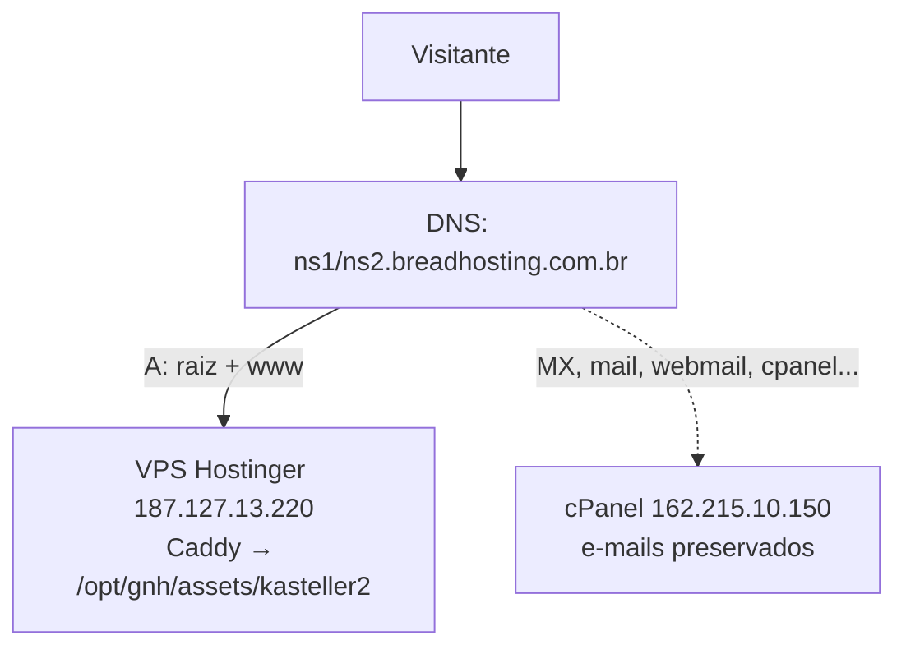

# Kasteller — Infraestrutura e DNS

> Domínio de produção: **kasteller.com.py** (no ar desde 09/08/2026)
> Endereço antigo, ainda funciona: `https://gnh.vortex369.com.br/assets/kasteller2/`

## Visão geral



O site **não tem deploy próprio**: os arquivos chegam em `/opt/gnh/assets/kasteller2/`
pelo autodeploy da GNH (cron a cada 2 min, que copia `assets/` inteiro do repo).
Publicar Kasteller = `git push` na branch de sempre.

## O mapa de DNS — o que vai para onde

> [!important] A regra
> **Só a raiz e o `www` apontam para o VPS.** Todo o resto continua no cPanel,
> porque é lá que vive o e-mail.

| Registro | Tipo | Destino | Por quê |
|---|---|---|---|
| `kasteller.com.py` | A | **187.127.13.220** | o site |
| `www` | CNAME → raiz | (segue a raiz → VPS) | acompanha sozinho |
| `kasteller.com.py` | **MX** | `mail.kasteller.com.py` | **não tocar** — é o e-mail |
| `mail` | A | 162.215.10.150 | entrega do e-mail |
| `webmail` | A | 162.215.10.150 | acesso ao e-mail pelo navegador |
| `cpanel` | A | 162.215.10.150 | painel de hospedagem |
| `webdisk` | A | 162.215.10.150 | serviço do cPanel |
| `ftp`, `whm`, `autoconfig`, `autodiscover`, `cpcalendars`, `cpcontacts` | A | 162.215.10.150 | serviços do cPanel |
| `_dmarc`, `_acme-challenge`, `_cpanel-dcv-test-record` | TXT | (como estão) | validação e política de e-mail |
| `_caldav`, `_carddav`, `_caldavs`, `_carddavs` | SRV | apontam para a raiz | ⚠️ quebram (ver abaixo) |

> [!danger] A armadilha dos CNAMEs
> `webmail`, `cpanel` e `webdisk` eram **CNAME apontando para a raiz**. Quando a raiz
> passou a apontar para o VPS, os três foram junto — e o webmail parou. Tiveram que
> virar registros **A** para `162.215.10.150`.
> Regra geral: ao migrar o site de um domínio que tem e-mail no cPanel, **procure todo
> CNAME que aponta para a raiz** antes de trocar o A.

### Pendências conhecidas

- [ ] `cpanel.kasteller.com.py` ficou em `162.215.10.50` — falta o "1" (correto: `.150`)
- [ ] Os 4 SRV (`_caldav`/`_carddav`, portas 2079/2080) apontam para a raiz e vão ao VPS.
      Só afeta quem sincroniza agenda/contatos pelo cPanel. Corrigir = destino `mail.kasteller.com.py`.
- [ ] **Não existe registro SPF** (`v=spf1`) e o DMARC está em `p=quarantine` — e-mails
      saindo de `@kasteller.com.py` podem ir para spam. É anterior à migração, mas vale resolver.

### TTL

Estava em 14400 (4 h) e foi baixado para 300 durante a migração. Com 14400, uma correção
demora até 4 horas para chegar em quem já tinha consultado o domínio — foi o que fez o
site aparecer no celular e continuar velho no desktop por horas.

## O bloco do Caddy

Guardado em `deploy/caddy-kasteller2.txt`. Vive no Caddyfile **compartilhado** do VPS:

```caddy
kasteller.com.py, www.kasteller.com.py {
	root * /opt/gnh/assets/kasteller2
	encode gzip
	file_server
}
```

> [!danger] O Caddyfile é imutável (`chattr +i`)
> **Esta é a pegadinha que custou uma hora.** O arquivo está protegido com o atributo
> imutável do Linux — provavelmente desde o incidente em que o autodeploy do poker-bot
> o sobrescreveu e derrubou todos os domínios.
>
> Resultado: `cat >> /etc/caddy/Caddyfile` **falha em silêncio** ("Operation not
> permitted" se perde no meio da saída), e o `caddy validate` continua respondendo
> "Valid configuration" — porque validou o arquivo **antigo**. Tudo parece certo e nada
> mudou.
>
> ```bash
> lsattr /etc/caddy/Caddyfile      # um "i" nos atributos = travado
> chattr -i /etc/caddy/Caddyfile   # destrava
> # ... edita ...
> caddy validate --config /etc/caddy/Caddyfile && systemctl reload caddy
> chattr +i /etc/caddy/Caddyfile   # TRAVA DE NOVO
> ```

### Sinal falso que confunde o diagnóstico

`curl -I -H "Host: kasteller.com.py" http://127.0.0.1/` responde **308 → https** mesmo
quando o domínio **não está** no Caddyfile: o redirecionamento HTTP→HTTPS do Caddy é
genérico e monta o `Location` a partir do cabeçalho `Host`. **Não use o 308 como prova
de que o site está configurado.**

O que realmente prova:

```bash
# o domínio aparece na lista de TLS gerenciado?
journalctl -u caddy | grep "enabling automatic TLS" | tail -1
# e o teste definitivo (SNI correto — header Host não serve para TLS):
curl -sI --resolve kasteller.com.py:443:127.0.0.1 https://kasteller.com.py/
```

`HTTP/2 200` = servindo, com certificado emitido.

## Checklist para publicar em domínio novo

1. DNS: A da raiz + conferir CNAMEs que apontam para a raiz
2. Caddy: `chattr -i` → bloco → `validate` → `reload` → `chattr +i`
3. No HTML: `canonical`, `og:url`, `og:image`, tirar `noindex`, `robots.txt`, `sitemap.xml`
4. `KHOSTS` no `index.html` — o detector de clones precisa conhecer o domínio novo,
   senão o site se denuncia como cópia de si mesmo no analytics
5. Testar em rede diferente (celular com dados móveis) — o desktop mente por cache

---

**Ver também:** [[01 - Buscador e palavras-chave]] · [[GNH - Sitio Web/02 - Infraestrutura e DNS|Infra da GNH]]
